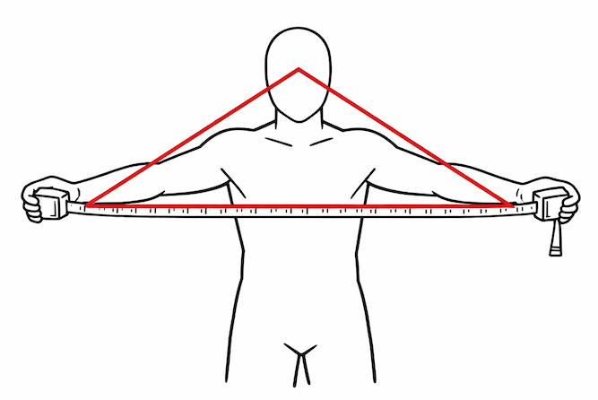
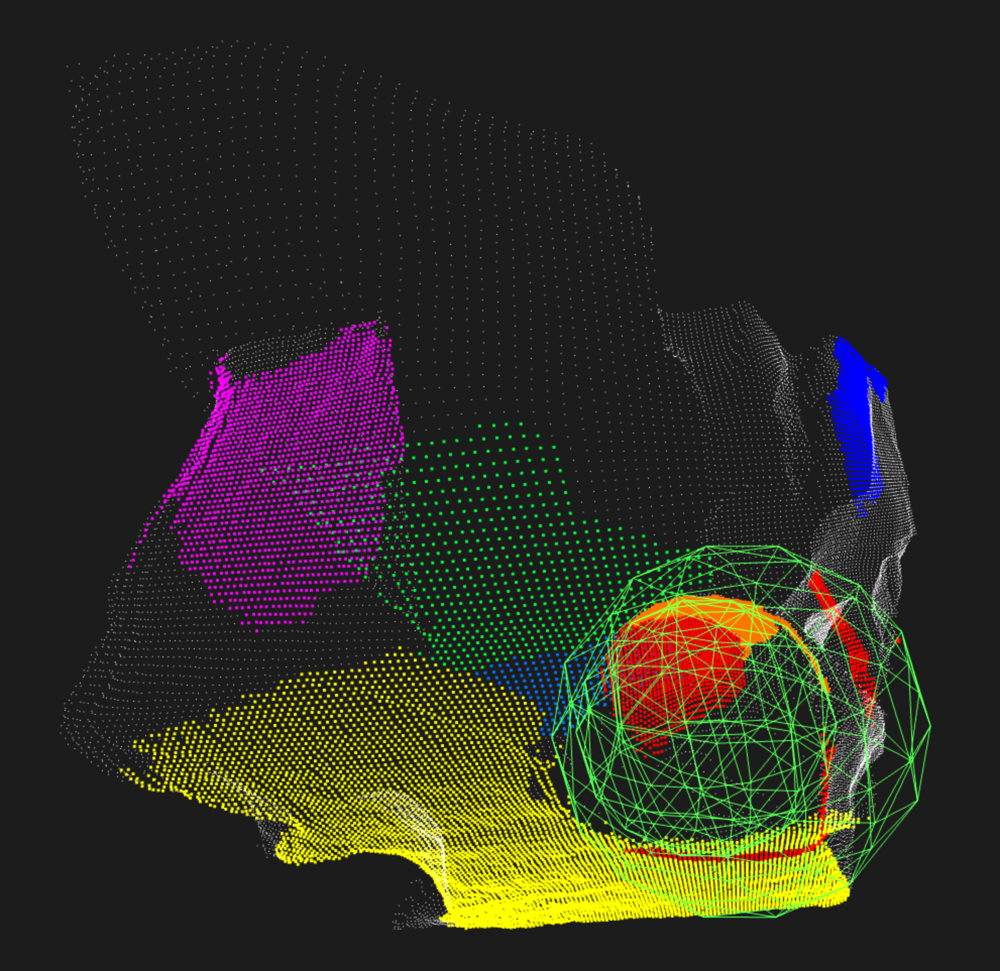
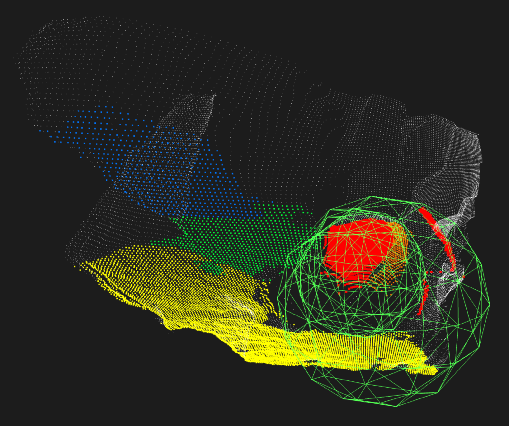
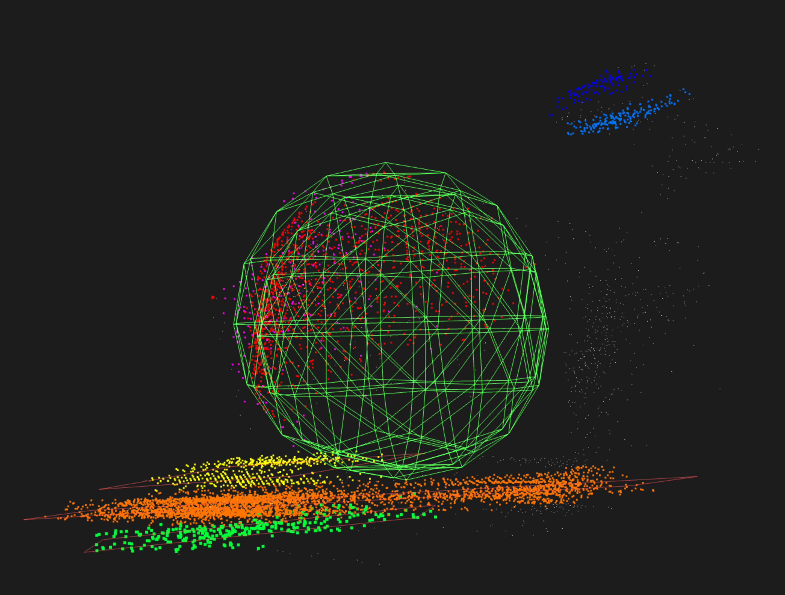
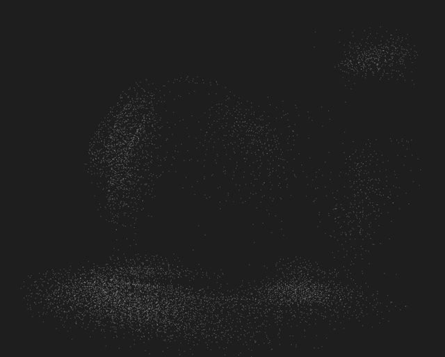

# Point Cloud Recorder - Galaxy XR

## Overview

PointCloudRecorder_GalaxyXR is a sample application developed by CurvSurf for recording point clouds using Galaxy XR devices. The application visualizes the depth map of the scene the user is observing (obtained via Android XR ARCore) in the upper-left corner of the screen, reconstructs a point cloud from the depth data, accumulates it over time, and allows the result to be exported as a file for further analysis.

**TL;DR**
Android XR currently exposes depth data suitable for visualization, but not enough synchronized and calibrated information for reliable metric point cloud reconstruction.

> **Note**
> This sample project was developed and tested specifically for **Galaxy XR**.
> Although it may run on other Android XR-compatible devices, correct behavior **cannot be guaranteed**.

### Basic Usage

- When the app starts, two panel windows appear: a map display window at the top-left of your view, and a control panel near your left hand at rest.
- The map display window follows your head to remain within your field of view, showing either the depth map or the confidence map depending on the selected mode.
- The control panel can be brought closer by touching the middle finger and thumb of your left hand.
- That’s all. The UI is intentionally minimal and designed to be self-explanatory.

## Background and Motivation

Originally, this project was started as a counterpart to [the sample projects](https://github.com/CurvSurf/FindSurface-visionOS?tab=readme-ov-file#samples) we had previously developed for **Apple Vision Pro**. From our perspective, Apple Vision Pro does not expose any developer-accessible means to obtain *useful* raw 3D measurement data from the user's real environment, *such as raw feature points, depth maps, or point clouds*, other than meshes.

As a result, we were only able to test **FindSurface** using mesh vertices in a very limited manner (see [here](https://github.com/CurvSurf/FindSurface-RealityKit-visionOS-Real-Time), if you are interested).

When we learned that **Galaxy XR** would ship with a depth sensor, we immediately obtained the device upon release and began this experimental sample project.

## Implementation Details

### Acquiring the Depth Map

Using the Android XR API, `DepthMap` data can be obtained for **left**, **right**, or **mono** views via independent `StateFlow`s. Galaxy XR provides left and right depth maps (mono is not available).

```kotlin
DepthMap.left(session)?.state?.collect { state -> 

    val depthMap = state.rawDepthMap ?: return
    val confidenceMap = state.rawConfidenceMap ?: return

    val width = state.width
    val height = state.height

    ...
}
```

Each flow provides both **raw** and **smoothed** versions of the depth and confidence maps.

- **Raw** depth maps may contain invalid or missing pixels where measurements failed.
- **Smoothed** depth maps fill all pixels but introduce interpolated (and therefore potentially incorrect) values.

Since **FindSurface** works better with sparse but *accurate* data than with dense *noisy* one, we chose to use the **raw** depth maps.

Below is a screen recording demonstrating visualization of both depth maps:

[](https://www.youtube.com/watch?v=9xtaKmCywrg)
***Fig 1.** Galaxy XR raw depth map visualization (click the image to watch)*

One notable observation is that:

- The left depth map covers the full field of view.
- The right depth map contains shadowed regions on the right side where depth values are missing.

This suggests that the right depth map may be a reprojection of left-based depth data into the right eye's view (note: this is just a hypothesis; we did not verify it conclusively). Artifacts can be observed on the right side of the left arm around 9 seconds, and on the left corridor wall at 15 seconds (the thumbnail shows it).

For this reason, we exclusively used the left depth map.

### Point Cloud Reconstruction

As is well known, reconstructing a point cloud defined in world coordinate space from a depth map requires:

- Camera (or sensor) **intrinsic parameters** (focal length, principal point)
- Depth map **resolution**
- Camera (or sensor) **pose** (i.e., inverse view matrix)

The **resolution** is provided by `DepthMap`, and the **pose** can be obtained from `RenderViewpoint`. However, the **intrinsic parameters** are not provided. They are not included in `DepthMap.State`, nor are they documented in the official Android XR documentation.

In short, Android XR currently provides sufficient data for rendering, but not for metric depth-based reconstruction.

`RenderViewpoint`, like `DepthMap`, provides **left**, **right**, or **mono** views. On Galaxy XR, left and right viewpoints are available, and the following data can be obtained:

- Pose of each eye in world coordinates
- Pose of each eye in device coordinates
- Four field-of-view angles: left, right, up, down

From these angles, it is clear that the projection transform is not necessarily symmetric about the center of projection. In fact, for Galaxy XR, both `RenderViewpoint`s are vertically symmetric but horizontally asymmetric.

#### Working assumption: Asymmetric FOV

According to [the official Android XR documentation](https://developer.android.com/reference/kotlin/androidx/xr/arcore/RenderViewpoint), this data is intended for rendering and represents the view of the left and right eyes, or a mono view.

The actual values of the angles obtained from `RenderViewpoint` were:

```kotlin
val fovAngleLeft = -0.95099926f
val fovAngleRight = 0.6959626f
val fovAngleUp = 0.9175058f
val fovAngleDown = -0.9175058f
```

These values are in radians. Converted to degrees, they correspond to approximately:
- Horizontal FOV: ~95°
- Vertical FOV: ~105°

Using these values, we constructed a projection frustum and derived intrinsic-like parameters as follows:

```kotlin
val fov = viewpointFlow.value.fieldOfView
val near = 0.01f
val far = 10f
val left = tan(fovAngleLeft) * near
val right = tan(fovAngleRight) * near
val bottom = tan(fovAngleDown) * near
val top = tan(fovAngleUp) * near

Matrix.frustumM(
    projectionMatrix.data, 0,
    left, right, bottom, top, near, far
)

val fx = width * near / (right - left)
val fy = height * near / (top - bottom)
val ppx = 0.5f * width - (right + left) / (right - left) * width / 2
val ppy = 0.5f * height - (top + bottom) / (top - bottom) * height / 2
```

Since no API explicitly exposes data intended for point cloud reconstruction from the depth sensor, we used `RenderViewpoint` parameters as a substitute, exported the resulting point cloud, and tested it in [our Web-based analysis tool](https://developers.curvsurf.com/WebDemo/).

#### Paleolithic Methods: Symmetric FOV

Separately, we attempted a deliberately naive and informal approach to estimate FOV angles for the depth map based on:

- The depth map resolution is square, so maybe the FOV angles in horizontal and vertical are the same.
- The depth sensor projection is symmetric.

The procedure was as follows:

***Fig 2.** We had to make do with what we had.*

1. Wearing the Galaxy XR headset, one extended both arms evenly while holding a tape measure, adjusting the tape so that both hands were just barely visible at the horizontal edges of the depth map.
2. This forms a triangle between the two hands and the headset. We then put both hands against a wall and measured the distance from the wall to the headset.
3. From this geometry, we estimated rough horizontal and vertical FOV values since we have both base and height of the triangle.

Naturally, this method is extremely crude and unreliable. However, repeated measurements yielded values roughly between 85°~95°, and a 90° symmetric FOV produced point clouds that looked reasonably plausible.

Both reconstruction approaches produce point clouds that clearly contain distortions. Unfortunately, we have no ground-truth reference that we can validate correctness.

We cannot determine:
- Which approach (if either) is correct
- Whether one is correct but distorted due to potential sensor limitations
- Or whether both are simply using incorrect parameters

At the time of writing, Android XR and Galaxy XR lack sufficient public documentation to resolve this uncertainty. (If you happen to know more, we would greatly appreciate any insights.)


### Visualization Results

| symmetric | asymmetric |
|:---------:|:----------:|
|  |  |
|  |  |

***Table 1.** Comparison of point cloud reconstructions using symmetric and asymmetric projection assumptions. Despite different projection models, both reconstructions exhibit similar surface distortions and fail to preserve the true spherical geometry.*

In both reconstruction approaches, the resulting point clouds failed to faithfully represent the surface geometry of a **spherical object**.

A surface that should have been smooth and uniformly curved appeared instead **slightly deformed and noticeably uneven** (See the gif images above). When processed by FindSurface, the point cloud did not yield a single sphere with the correct radius. Instead, two distinct spheres with different radii were detected, neither of which matched the real-world value.

We believe this behavior is more likely attributable to distortion inherent to the depth sensor itself, rather than inaccuracies in the intrinsic parameters used during reconstruction.

If the dominant source of error had been incorrect intrinsic parameters (e.g., focal length or principal point), the resulting distortion would be expected to exhibit a systematic and distance-dependent pattern. Such errors typically manifest as global deformations where points bend or drift coherently according to a predictable rule, which is similar to a shear or a stretching along a particular axis.

To minimize the impact of intrinsic-related distortion, the spherical object was deliberately positioned near the center of the field of view, where projection errors caused by incorrect intrinsics are generally least pronounced. Despite this precaution, the reconstructed surface of the sphere remained irregular and noisy.

For this reason, we consider it highly likely that the observed deformation originates from limitations of the depth sensing process itself, rather than from the choice of projection or reconstruction parameters.

### Filtering, Accumulation, and Synchronization Issues

Given the inherent distortion in the raw depth data, we concluded that directly using the data without filtering was not meaningful.

Previously, we released FindSurface sample projects that runs on Google Android smartphones and Apple iPhones/iPads without LiDAR. These projects accumulate feature points to build a point cloud and detect geometry in real time. This approach is based on the fact that even though individual samples are noisy, the accumulated data tends to converge toward the true geometry under a roughly Gaussian error distribution (see [here (Android)]() and [here (iOS)](), if you are interested).

Inspired by this approach, we applied **Random sampling** to the depth map and used foveated sampling, collecting more samples near the center of the view.


***Fig 3.** Accumulated point cloud generated using random and foveated sampling from depth maps. While planar surfaces become more stable through accumulation, temporal misalignment between depth maps and viewpoints introduces visible ghosting and spatial offsets.*

However, another significant issue emerged.

`DepthMap` and `RenderViewpoint` are published independently using `StateFlow`s with no synchronization mechanism.
- `DepthMap` updates roughly every 130~170 ms, randomly stalling up to 700 ms. (Maybe due to the garbage collector?)
- Left and right depth maps are delivered asynchronously.
- `RenderViewpoint`, by contrast, updates consistently at 16-17 ms.

Crucially, `DepthMap` provides no timestamp, making it impossible to determine when a given depth map was captured relative to the viewpoint. (`PerceptionState` might be the key to the sync issue, but no publicly documented way to obtain it.)


***Fig 4.** The three-layered appearance of the spherical surface in the point cloud (ghosting artifacts) strongly suggests that samples acquired at different times were not consistently associated with the correct camera pose.*

As a result, we were forced to associate each depth map with the most recently published `RenderViewpoint`. This led to visible ghosting artifacts, where samples from the same surface appeared slightly offset.

Assuming a maximum walking speed of 1.2 m/s, even a 17 ms mismatch results in a positional error of approximately 20 cm. While this is a simplified worst-case estimate, combined with the previously discussed issues, the result were unsatisfactory.

At this point, we decided to abandon further attempts at integrating **FindSurface** on this project and instead publish our findings here.

It is possible that the APIs used in this experiment were never intended to support metric point cloud reconstruction, and that the observed limitations reflect design constraints rather than implementation flaws.

## Desired Improvements

Android XR is still under active development (as of mid-December 2025, version 1.0.0-alphaXX). This platform currently lacks several capabilities necessary for deeper investigation and visualization.

Some of the following limitations are critical, while others are merely wishlist items:

- There is no way to create a mesh entity directly from memory; only loading glTF files is supported. As a result, we could not visualize point clouds directly in 3D space and had to overlay them onto the depth map.

- Depth map updates are slow and irregular. While not entirely unusable, this makes immersive depth-based experiences in dynamic environments extremely difficult.

- Exposing motion-tracking feature points as a public API would be highly desirable. These points are already generated internally for tracking device motions so it would likely not be technically difficult to make the API public. It would unlock significant potential when combined with FindSurface (Again, see []() and [](), if interested).


## Closing Remarks

We are not Android XR experts, and it is entirely possible that we have overlooked mistakes or misunderstood certain aspects of the platform. If you notice any errors, or if you have additional information that could help clarify these issues, please feel free to open an issue and share your insights.

Thank you for reading.
